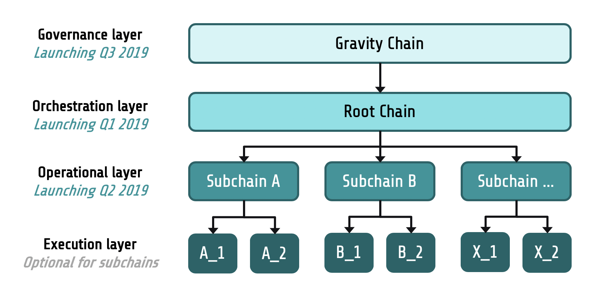
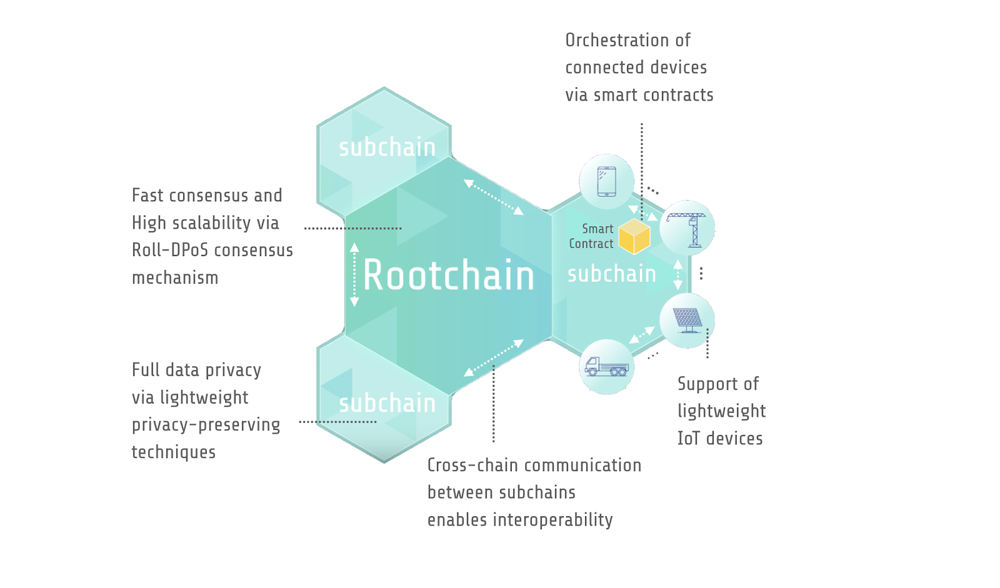

# IoTeX 文档

## 简介

作为 2017 年成立开源项目，IoTeX 正在为物联网（IoT）构建世界领先的自动可扩展和以隐私为中心的区块链平台。我们的使命是为合作的时代构建去中心化的信任结构，包括设备间数据交换、应用程序和人员之间。我们内部正在开发多种创新技术，包括用于异构计算的区块链和区块链架构，快速且稳健的 Roll-DPoS 共识方案，以及高效的可信计算协议。更多细节可以在[这里](https://iotex.io/academics)找到。IoTeX 核心团队正在不断努力为社区带来更酷的功能。

## 宏观设计

IoTeX 网络的总体设计采用了分权思想，这是 Charles-Louis de Secondat 创造的一个术语，它指出民主政治权力应该分为立法，行政和司法权力。总的来说，IoTeX 网络是一种由多个区块链组成的去中心化的信任结构，用于连接人，机器，应用程序，不同的分层等级用于服务不同目的。



* 治理层，由重力链实例化的治理层是扮演 IoTeX 网络的去中心化政府。它专注于权力下放和安全，是一种以活跃度为导向的共识机制（例如，PoS variant），用以促进诸如权益质押、投票、罚没、与协议相关的提案等任务。在 2019 Q3 / Q4 重力链发布之前，以太坊主网将用作治理层。
* 业务流程层，由根链实例化而来，是所有子链的管理者和协调员。它由我们以安全为导向的 Roll-DPoS 共识机制提供支持，旨在实现合理的吞吐量，可靠性和透明度。它将于 2019年  4 月推出（Mainnet Alpha），作为 IoTeX 网络中的第一个区块链。
* 操作层，是各种 layer2 子链的实例化，操作层是处理与特定用例/应用程序相关的业务逻辑的具体单元。不同的子链可以通过跨链通信相互操作。第一个 IoTeX 子链预计将于 2019 年 Q2/Q3 推出，专注于可信计算。
* 执行层，是一个可选层，特定子链可以卸载具体的计算/存储任务到该层上。状态生成过程中的分离验证和订购状态对于提高去中心化系统的可扩展性，功能性和可用性非常有帮助。

在我们的设计中，所有区块链共享相同的投票资源池，以此产生共识是整个网络安全的保障，也是集体信任的基石。通过提供的集体信任，可以轻松地启动子链，就像在 AWS 云上启动 EC2 实例一样轻松。由于 EDR 的抽象化，在 IoTeX 网络中运行的子链具有截然不同的状态转换和执行层以及基础加密经济。

我们之所以将责任划划分给多个区块链层，是因为我们坚信去中心化的治理。许多 DPoS 区块链在核心操作层上管理区块链的治理任务（如 质押/投票） - IoTeX 认为治理层不应与同一链上的操作层在一起。例如，当选的代表作为既得利益集团，可以忽视区块生产过程中的质押或投票交易，以减少被取消选举的可能（即利益冲突）。还有，当选代表可以执行协议升级（未经其他用户同意升级其软件），这些升级可能会不利于整个生态的其他部分。

## 介绍

### 根链

根链将在2019年第一季度推出（又名 Mainnet Alpha），它由四层组成：

* 网络层支持 IoTex 节点之间的点对点通信，并为其他应用程序和用户提供区块链服务（通过[grpc](https://grpc.io/)）。
* 共识层使用去中心化分散随机算法（DKG + BLS）运行 Roll-DPoS 在区块生产者候选池（通过质押或投票）中选择活动块的生产者。
* 状态转换层由五个子协议组成，负责将区块链的状态从一个转换为另一个。
* 编程层实现了业务逻辑的状态转换。目前仅支持使用 Solidity 编写的以太坊虚拟机（EVM）智能合约。开发人员可以无缝地将现有的DAPP移植到它上面。



### 子协议和动作

IoTex 根链的状态转换层足够灵活，支持简易的插入任何子协议。

* 帐户子协议为在此区块链上的帐户的提供记账功能。
* 执行子协议管理智能合约的执行和前进/回退状态。
* 轮询子协议与以太坊上的质押/投票的合约同步（在重力链准备好之前由以太坊扮演），并指导在 IoTeX 根链上升级/降级的投票。
* 奖励子协议负责向合格的代表和候选人分发区块奖励和纪元奖励。
* Multichain子协议管理子链管理和交叉链通信，这是一项正在进行的工作。

在 IoTeX 网络中，事务（与区块链数据交互的原子操作单元）被称为“动作”，存在与所描述的五个子协议相对应的五种类型的动作。更多信息可以在[这里](https://github.com/iotexproject/iotex-core/blob/master/proto/types/action.proto)找到。

## 构建并运行

使用 IoTeX 软件包的最简单方法是以独立模式运行它以进行演示和测试。“独立”表示单个节点本身构成整个区块链，生成新块，验证块，并将块添加到区块链。这种简单模式允许用户使用单个计算机/节点快速启动和测试区块链，而无需太多硬件资源。

#### From the source <a id="from-the-source"></a>

1. 设置 golang 环境，例如，[在 Linux 上](https://medium.com/@RidhamTarpara/install-go-1-11-on-ubuntu-18-04-16-04-lts-8c098c503c5f)，[在 MacOS 上](https://medium.com/golang-learn/quick-go-setup-guide-on-mac-os-x-956b327222b8)
2. `git clone git@github.com:iotexproject/iotex-core.git`
3. `make run`

### 使用docker镜像

1. 通过 https://docs.docker.com/install/ 在本地主机上安装 docker。正确安装和启动 docker 后，下载 IoTeX docker 镜像：`docker pull iotex/iotex-core:latest`
2. 从 [iotex-core](https://github.com/iotexproject/iotex-core) 下载配置文件 [config\_delegate.yaml](https://github.com/iotexproject/iotex-core)。打开文件并根据独立节点的需要修改某些参数。例如，blockCreationInterval 指定生成下一个块所花费的时间（以秒为单位）。如果您希望以较慢的速度生成块，请将其更改为更大的值。
3. sudo docker run -d -p 30100:14004 --mount type=bind,source=$PWD/config\_delegate.yaml,target=/etc/iotex/config\_local\_delegate.yaml iotex/iotex-core:testnet iotex-server -config-path=/etc/iotex/config\_local\_delegate.yaml

## ioctl \(command-line interface\)

ioctl 是一个用于与 IoTeX 区块链交互的命令行界面。

```text
Usage:
  ioctl [command]

Available Commands:
  account     Deal with accounts of IoTeX blockchain
  action      Deal with actions of IoTeX blockchain
  xrc20       Operate XRC20 contracts
  bc          Deal with block chain of IoTeX blockchain
  help        Help about any command
  node        Deal with nodes of IoTeX blockchain
  version     Print the version number of ioctl

Flags:
  -h, --help   help for ioctl
```

### 安装发行版

```
curl https://raw.githubusercontent.com/iotexproject/iotex-core/master/install-cli.sh | sh
```

### 安装最新版

```text
curl https://raw.githubusercontent.com/iotexproject/iotex-core/master/install-cli.sh | sh -s "unstable"
```

## 用法和示例

所有ioctl命令的示例文档。

## 配置

`Variables: [endpoint, wallet, explorer, defaultacc]`  
`Explorers: [iotexscan (default), iotxplorer, custom]`

### **设置配置**

`Usage: ioctl config set VARIABLE VALUE`

```text
➜  ioctl config set endpoint api.iotex.one:443
endpoint is set to api.iotex.one:443
```

### **获取配置**

`Usage: ioctl config get VARIABLE | all`

```text
➜  ioctl config get wallet
/Users/IoTeX/.config/ioctl/default
```

### 重置配置

`Usage: ioctl config reset`

```text
➜  ioctl config reset
Config reset to default values
```

## 账户

### 创建账户

`Usage: ioctl account create`

```text
➜  ioctl account create
{
  "accounts": [
    {
      "address": "io12ly97a3sk94ne06qjz2vv6clv3za7mk2z2sra9",
      "privateKey": "bb59a2a2c21242831906e0c8d188c642fdc1324d27ac4ae0d8cbea373b22147b",
      "publicKey": "040780ba149d24ee5418084ee193a6be8b3b7cf5329d160fc8902270b342c4fed4b646cdd5fdaf52932eecb957297a9bf6dbb24f7faa9287a27df6b5e83781c74b"
    }
  ]
}
```

```text
➜  ioctl account create -n 3
{
  "accounts": [
    {
      "address": "io1dcx2490vk2sg0f7ujv9d3gu67rpvyk5rjp854s",
      "privateKey": "a40ffd19150b4f3cbb1ca779862fc63b15d432c0be9bba81c56856d00e370b91",
      "publicKey": "04483333bf900b59a412c26a8cf287e122be5d2882d66263ce330a2c84e426fcf48dca4e189dbef15dc3511b049b7708c1e3a49e4904a6286ffcc6019bb27a4ca9"
    },
    {
      "address": "io19sypnkmj6agqqgusht07m35lvlhz4ruehetagk",
      "privateKey": "fd49783f8687379e3eb6e5778977044cc7e464dd16df8444b8643d3d636f7ebc",
      "publicKey": "04bcae59b817ec2924adef52088e9295bb040d1a34fe49e64b41ca56e2cbb3be115256975d2c1472b0a3b47bea720810de092ef4d209924ce09fa896b29588a90d"
    },
    {
      "address": "io1ehlhw6kedp5x8y04ddr7fl0cs68ns32hdxuvdl",
      "privateKey": "2c1bdc74c7ff03f08f2e2d3b65af9a54dc5addc42613670bd4bb1f0440cd9468",
      "publicKey": "04cd1ff13e20cbe83bc8759ce21404edc2a9b78c57f8d2ffc648f2213dfee98b61d9ebaffe03f32e7a13fbe319b1958c99ed701c3fa1046790f6af12f32262309b"
    }
  ]
}
```

### 在钱包中创建一个账户

`Usage: ioctl account createadd ALIAS`

```text
➜  ioctl account createadd IOsenser
#IOsenser: Set password
#IOsenser: Enter password again
New account "IOsenser" is created.
Please Keep your password, or your will lose your private key.
```

### **使用**私钥导入账户

`Usage: ioctl account import [key|keystore] ALIAS` 

Two options are available. 

If you use `key`,

```text
➜  ioctl account import key whale
#whale: Enter your private key, which will not be exposed on the screen.
#whale: Set password
#whale: Enter password again
New account #whale is created. Keep your password, or your will lose your private key.
```

If you use `keystore`,

```text
➜  ioctl account import keystore whale
```

### **从帐户导出私钥**

`Usage: ioctl account export (ALIAS|ADDRESS)`

```text
➜  ioctl account export whale
Enter password #whale:
xxxxxxxxxxxxxxxxxxxxxxxxxxxxxxxxxxxxxxxxxxxxxxxxxxxxxxxxxxxxxxxx
```

### **删除帐户**

`Usage: ioctl account delete (ALIAS|ADDRESS)`

```text
➜  ioctl account delete whale
** This is an irreversible action!
Once an account is deleted, all the assets under this account may be lost!
Type 'YES' to continue, quit for anything else.
yes
Enter password #io1t54nfdnpldaxkpm35f2gzh3rx6cakypmp5xfz5:
Account #io1t54nfdnpldaxkpm35f2gzh3rx6cakypmp5xfz5 has been deleted.
```

### **列出所有帐户**

`Usage: ioctl account list`

```text
➜  ioctl account list
io1r2r0um9dw35922tptkuphseq43hq2knk3fjrlt - IOsenser
io17laykjt9qgafuxj58fuspuxzlv6y4qgxf82vnm - frank
io1l3wc0smczyay8xq747e2hw63mzg3ctp6uf8wsg
io14gnqxf9dpkn05g337rl7eyt2nxasphf5m6n0rd - 007
```

### **查询余额**

`Usage: ioctl account balance (ALIAS|ADDRESS)`

```text
➜  ioctl account balance IOsenser
io1r2r0um9dw35922tptkuphseq43hq2knk3fjrlt: 0.721 IOTX
```

```text
➜  ioctl account balance io1l3wc0smczyay8xq747e2hw63mzg3ctp6uf8wsg
io1l3wc0smczyay8xq747e2hw63mzg3ctp6uf8wsg: 4689 IOTX
```

### **查询Nonce**

`Usage: ioctl account nonce (ALIAS|ADDRESS)`

```text
➜  ioctl account nonce IOsenser
io1r2r0um9dw35922tptkuphseq43hq2knk3fjrlt:
Nonce: 0, Pending Nonce: 1
```

### **翻译地址**

`Usage: ioctl account ethaddr (ALIAS|IOTEX_ADDRESS|ETH_ADDRESS)`

```text
➜  ioctl account ethaddr io14gnqxf9dpkn05g337rl7eyt2nxasphf5m6n0rd
io14gnqxf9dpkn05g337rl7eyt2nxasphf5m6n0rd - 0xAA260324ad0DA6FA2231f0FfEC916A99bb00dd34
```

```text
➜  ioctl account ethaddr 0xAA260324ad0DA6FA2231f0FfEC916A99bb00dd34
io14gnqxf9dpkn05g337rl7eyt2nxasphf5m6n0rd - 0xAA260324ad0DA6FA2231f0FfEC916A99bb00dd34
```

```text
➜  ioctl account ethaddr 007
io14gnqxf9dpkn05g337rl7eyt2nxasphf5m6n0rd - 0xAA260324ad0DA6FA2231f0FfEC916A99bb00dd34
```

### **更新帐户密码**

`Usage: ioctl account update (ALIAS|ADDRESS)`

```text
➜  ioctl account update IOsenser
#IOsenser: Enter current password
#IOsenser: Enter new password
#IOsenser: Enter new password again
Account #IOsenser has been updated.
```

###  

####   <a id="install-latest-unstable-build"></a>

##  


