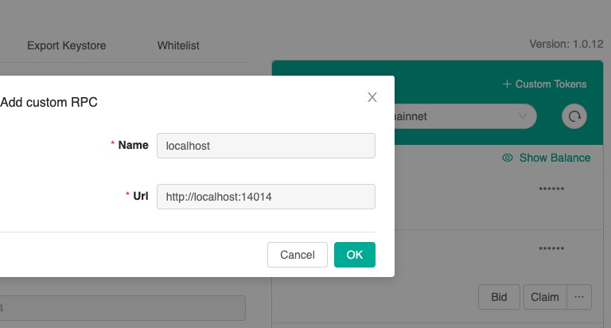

# Start dev env as easy as possible

This is the script to start the local development environment of IoTeX blockchain which basically:
- starts an IoTeX blockchain in standalone mode and creates the following 10 accounts with IOTEX_IMAGE
- installs ioctl if not already installed, sets ioctl's endpoint to localhost:14014

```
(0) io1pt6zphmmc6c8wzdlnuu0gd42la88jtgywcfvsm
(1) io1ehdwp3guupv9tquvzrq9hpc6j9gdydxgmk232r
(2) io1tlq4edtl0gxvgxtvqjla80k3d8qrl8ldu48w0s
(3) io1cz255uwrnnkmuaz0ftspqc7wnupud4fejm2tem
(4) io1azslw74n8glqvq7x3u0n85fefe4kfzl7m0h85v
(5) io1k4rd2de2q67s9aa48fs5n3sqkw07sk65cvwf9f
(6) io1emvxuun0983knn3sd2sey2q87lydc6pwurpqtn
(7) io1d98e0jfkdzy6pj2gqmmlh59wsr4dmx07sg2f3q
(8) io1au9m2f6qeg8swcushc27e0cc8k2ud8qrk7yl2x
(9) io169nad8cl0fl3zpwq4c6kg5wtzd90293jwzj8us
```

```
./setup.sh     # install, set up, configure, create some test accounts and finally start the service
./setup.sh -q  # same as ./setup.sh, but not build image
./setup.sh -c  # clean all data except image
./control.sh stop  # stop the server
./control.sh start # start the server
```
After installation of this local development environment, one can use:
- truffle to write/compile/test contracts and ioctl to deploy them, e.g., https://docs.iotex.io/developer/ioctl/contract.html
- [IoTeX Studio](http://ide.iotex.io/) to write/compile/test/deploy contracts
- [ioPay](https://iopay.iotex.io/) Set:

